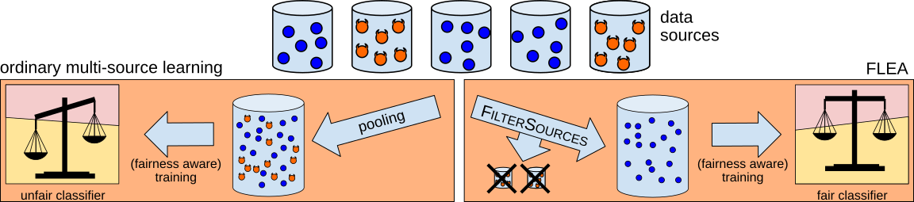

# FLEA: Provably Robust Fair Multisource Learning from Unreliable Training Data

Eugenia Iofinova and Nikola Konstantinov and Christoph H. Lampert. *"FLEA: Provably Robust Fair Multisource Learning from Unreliable Training Data",* Transactions on Machine Learning Research (TMLR), 2022.

manuscript: [arXiv](https://arxiv.org/pdf/2106.11732.pdf),              [OpenReview](https://openreview.net/forum?id=XsPopigZXV),                     [TMLR - coming soon](.)

```bibtex
@article{iofinova-tmlr2022,
  author = "Eugenia Iofinova and Nikola Konstantinov and Christoph H. Lampert",
  title = "{FLEA}: Provably Robust Fair Multisource Learning from Unreliable Training Data",
  journal = "Transactions on Machine Learning Research (TMLR)",
  year = 2022,
}
```

## FLEA - Fair LEarning against Adversaries



A sufficient amount of clean and representative training data is crucial for the success of a machine learning project. In some situations, a suitable data sample may not be available from a single source, and so a dataset must be pooled from multiple sources . In the event that some of these data sources are corrupted, either via errors in data entry or via malicious perturbation, the resulting trained model might appear to be fair and accurate, while in reality being neither.

While these corrupted data are [impossible](https://proceedings.mlr.press/v171/konstantinov22a/konstantinov22a.pdf) to detect after pooling, it is possible to remove malignant _sources_ as a pre-filtering step, provided that the majority of sources are clean. FLEA is a pre-filtering step that uses tools from robust statistics to remove the sources that are most likely to be malignant before the data is pooled and the classifier is trained.


### Method and theoretical foundation

FLEA relies on estimates of two key quantities between every pair of sources: the empirical discrepancy and empirical disparity. The former measures the maximum possible difference in error of a single classifier on the data in the two sources; the latter measures the maximum possible difference in unfairness (defined as demographic parity violation relative to some attribute such as gender or race, but extensible to other fairness measures). A third quantity, necessary for a technical reason, is the empirical disbalance, measures the difference in the distribution of the protected attribute between the two sources.

The method relies on the observation that if two sources have low values for all three quantities, this implies that pooling their data is unlikely to have malignant effects, and vice versa - if one of the two sources is malignantly corrupted, at least one of the quantities will be high. Thus, FLEA removes those sources that tend to have at least one large score against a large number of other sources.

Under standard assumptions, FLEA provides statistical guarantees that the filtering process will be effective and the resulting classifier will closely match the performance of one trained on the clean data only.

### Practical results

In practice, the assumptions in FLEA are not exactly met - in particular, sample sizes may not be very large, and may not be drawn from identical distribution. We benchmark FLEA against other robust fair learning methods on several datasets: the Adult (Income prediction), Drugs, and GermanCredit datasets from the UCI machine learning repository, the COMPAS criminal recidivism dataset collected by ProPublica, and the FolkTables dataset. We split the first four of these randomly into multiple homogenous "sources", and split FolkTables by year (thus allowing some variation between the sources, for a heterogenous setting); we then apply a number of adversarial perturbations to (N-1)/2 of the sources (or a smaller number for FolkTables) before applying mitigations and training a model using several kinds of fairness-aware learning. We observe that the performance of FLEA closely matches that of oracle (keeping only the clean data) across the datasets and perturbations, so long as the number of samples in each source is sufficiently high.


## Code Structure
The source code and documentation can be found in the [src](src/) directory. 
