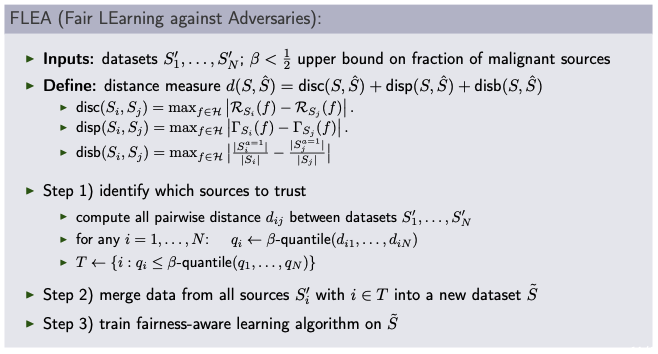

<!---<script
  src="https://cdn.mathjax.org/mathjax/latest/MathJax.js?config=TeX-AMS-MML_HTMLorMML"
  type="text/javascript">
</script>-->

# FLEA: Provably Robust Fair Multisource Learning from Unreliable Training Data

Eugenia Iofinova and Nikola Konstantinov and Christoph H. Lampert. *"FLEA: Provably Robust Fair Multisource Learning from Unreliable Training Data",* Transactions on Machine Learning Research (TMLR), 2022.

manuscript: [arXiv](https://arxiv.org/pdf/2106.11732.pdf), &emsp;&emsp; [OpenReview](https://openreview.net/forum?id=XsPopigZXV), &emsp;&emsp; [TMLR - coming soon](.)  &emsp;&emsp; [video](https://cvml.ist.ac.at/projects/FLEA/video.mp4)

```bibtex
@article{iofinova-tmlr2022,
  author = "Eugenia Iofinova and Nikola Konstantinov and Christoph H. Lampert",
  title = "{FLEA}: Provably Robust Fair Multisource Learning from Unreliable Training Data",
  journal = "Transactions on Machine Learning Research (TMLR)",
  year = 2022,
}
```

# FLEA - Fair LEarning against Adversaries

FLEA is a method that enables the training of accurate and fair classifiers in the event that the data is assembled from multiple sources that are not completely trustworthy - that is, some of them may have been manipulated by an adversary, or contain data entry errors.


## Motivation

A sufficient amount of clean and representative training data is crucial for the success of a machine learning project. In some situations, a suitable data sample may not be available from a single source, and so a dataset must be pooled from multiple sources. In the event that some of these data sources are corrupted, either via errors in data entry or via malicious perturbation, the training algorithm might select a model with parameter values that result in low error and unfairness on the (corrupted) data, while having high expected error, unfairness, or both on data drawn from the true distribution.

While these corrupted data are impossible ([Kearns and Li (1993)](https://epubs.siam.org/doi/10.1137/0222052), [Konstantinov & Lampert (2022)](https://proceedings.mlr.press/v171/konstantinov22a/konstantinov22a.pdf)) to detect once pooled, it is possible to remove malignant _sources_ as a pre-filtering step, provided that the majority of sources are clean. FLEA is a pre-filtering step that uses tools from robust statistics to remove the sources that are most likely to be malignant before the data is pooled and the classifier is trained.

## Formal problem statement

Consider a probability distribution _p_ with _N_ sources


Our goal is to select a classifier _f_ from a hypothesis space _H_ that minimizes the (expected) error and unfairness, using some (fairness-aware) learning algorithm


However, we account for the presence of an adversary that can manipulate some of the training sets.


It's important to know that we do not restrict the adversary's ability to modify the corrupted sources, nor their knowledge of the training algorithm. The only thing that we do require is that the proportion of corrupted sources be less than 1/2.


## Method

FLEA relies on estimates of two key quantities between every pair of sources: the empirical discrepancy and empirical disparity. The former measures the maximum possible difference in error of a single classifier on the data in the two sources; the latter measures the maximum possible difference in unfairness (defined as demographic parity violation relative to some attribute such as gender or race, but extensible to other fairness measures). A third quantity, necessary for a technical reason, is the empirical disbalance, measures the difference in the distribution of the protected attribute between the two sources.

The method relies on the observation that if two sources have low values for all three quantities, this implies that pooling their data is unlikely to have malignant effects, and vice versa - if one of the two sources is malignantly corrupted, at least one of the quantities will be high. Thus, FLEA removes those sources that have a high proportion of large D-scores against a large number of other sources.



We emphasize that FLEA is a pre-filtering step that is agnostic to the specific process used to select the classifier and thus works with any fairness-aware training algorithm. 


## Theoretical result

Under standard assumptions, FLEA provides statistical guarantees that the filtering process will be effective and the resulting classifier will closely match the performance of one trained on the clean data only. More specifically, if the hypothesis space _H_ allows learning without an adversary, then it also allows multi-source universal learning in the presence of an adversary.


We provide an analogous result in the case that the data sources are not i.i.d. (the heterogenous case).

## Practical algorithm

In practice, it is not feasible to exactly calculate the empirical discrepancy and disparity for many standard hypothesis classes, such as, for example, linear functions. Therefore, we estimate them as follows.

For the empirical discrepancy between two sources S and S', we follow PAPER, which observes that finding the classifier with the maximum discrepancy is equivalent to finding the one that predicts the correct label on S and the incorrect label on S' (equivalently, vice versa). Thus, we flip the the labels of S' before combining them into a single dataset and training a (non-fairness-aware) classifier to predict the label. If the two sources are drawn from the same distribution, it is not possible to train a classifier with a low error in this setting, and so the discrepancy is low. Contrary, if one of the data sources has been manipulated in such a way that the error can be made low, the discrepancy is high.

We use a similar idea to estimate disparity - in particular, we note that the maximally disparate classifier will predict 1 wherever the protected attribute is 1 and 0 otherwise on S, and the opposite on S' (or conversely). This can be achieved by training a classifier to predict _f(x) = a_ on S. To give both protected groups equal importance, as the definition requires, we use per-sample weights that are inversely proportional to the group sizes. To trade off the unfairness on S with the fairness on S, we simply add &#0915;(S') as a regularizer to this optimization problem. We then repeat the process with the roles of S and S' flipped and keep the larger of the two values as the estimate of disparity.


## Experimental validation

We performed an extensive experimental validation of FLEA, described below. Overall, we observe that the accuracy and fairness of classifiers trained using FLEA closely matches that of oracle across the datasets and perturbations, so long as the number of samples in each source is sufficiently high.

### Setup

For the homogenous case, we benchmark FLEA against other robust fair learning methods on several datasets: the Adult (Income prediction), Drugs, and GermanCredit datasets from the UCI machine learning repository, the COMPAS criminal recidivism dataset collected by ProPublica, and the FolkTables dataset. We split these first four of these randomly into five homogenous "sources" and allow the adversary to manipulate two of them. For the heterogenous case, we use the FolkTables dataset, which is naturally split into 51 states/regions. The adversary is given access to a varying (5-25) number of the sources. We use linear regression as the hypothesis space.

We use the following training strategies in combination with FLEA:

* Fairness regularization ([Kamishima et al., 2012](https://link.springer.com/content/pdf/10.1007/978-3-642-33486-3_3.pdf)) learns a fair classifier by minimizing a linear combination of the classification loss and the empirical unfairness measure &#0915;(S), where for numeric stability, in the latter the binary-valued classifier decisions f(x) are replaced by the real-valued confidences p(f(x) = 1|x).
1. Data preprocessing ([Kamiran & Calders, 2012](https://link.springer.com/article/10.1007/s10115-011-0463-8)) modifies the training data to remove potential biases. Specifically, it creates a new dataset by uniform resampling (with repetition) from the original dataset, such that the the fractions of positive and negative labels are the same for each protected group. On the resulting unbiased dataset it trains an ordinary fairness-unaware classifier.
1. Score postprocessing ([Hardt et al., 2016](https://papers.nips.cc/paper/2016/hash/9d2682367c3935defcb1f9e247a97c0d-Abstract.html)) first learns an ordinary (fairness-unaware) classifier on the available data. Afterwards, it determines which decision thresholds for each protected groups achieve (approximate) demographic parity on the training set, finally picking the fair thresholds with highest training accuracy.
1. Adversarial fairness ([Wadsworth et al., 2018](https://arxiv.org/abs/1807.00199)) learns by minimizing a weighted difference between two terms. One is the loss of the actual classifier; the other is the loss of a classifier that tries to predict the protected attribute from the real-valued outputs of the main classifier.

We use the following adversaries to perturb the affected samples:

* flip protected (FP), flip label (FL), flip both (FB): the adversary flips the value of protected attribute, of the label, or both, in all sources it can manipulate.
1. shuffle protected (SP): the adversary shuffles the protected attribute entry in each effected batch.
1. overwrite protected (OP), overwrite label (OL): the adversary overwrites the protected attribute of each
sample in the affected batch by its label, or vice versa.
1. resample protected (RP): the adversary samples new batches of data in the following ways: all original samples of protected group a = 0 with labels y = 1 are replaced by data samples from other sources which also have a = 0 but y = 0. Analogously, all samples of group a = 1 with labels y = 0 are replaced by data samples from other sources with a = 1 and y = 1.
1. random anchor (RA0/RA1): these adversaries follow the protocol introduced in [Mehrabi et al. (2021)](https://ojs.aaai.org/index.php/AAAI/article/view/17080). After picking anchor points from each protected group they create poisoned datasets consisting of examples that lie close to the anchors but have opposite label to them. The difference between RA0 and RA1 lies in which combinations of label and protected attribute are encouraged or discouraged.
1. identity (ID): the adversary makes no changes to the data.

We benchmark FLEA using the following training strategies (please see paper for details):

* Robust ensemble. Since in our experiments the number of sources is always odd, this is also equivalent to classifying using the majority vote rule.
1. Filtering method from [Konstantinov et al. (2020)](https://proceedings.mlr.press/v119/konstantinov20a.html)
1. DRO method from [Wang et al. (2020)](https://papers.nips.cc/paper/2020/hash/37d097caf1299d9aa79c2c2b843d2d78-Abstract.html)
1. hTERM method from [Li et al. (2021a)](https://arxiv.org/abs/2007.01162)
1. Ordinary fair training
1. Oracle (perfect knowledge of which sources are manipulated)

### Results

We present here some of the results for the preprocessing fairness method; full experimental results are available in the paper.

#### Summary of preprocessing-fairness based results


#### Detailed results on German Credit dataset


#### Detailed results on Folktables dataset with 20/51 sources corrupted


## Code Structure
The source code and documentation can be found in the [src](src/) directory. 
